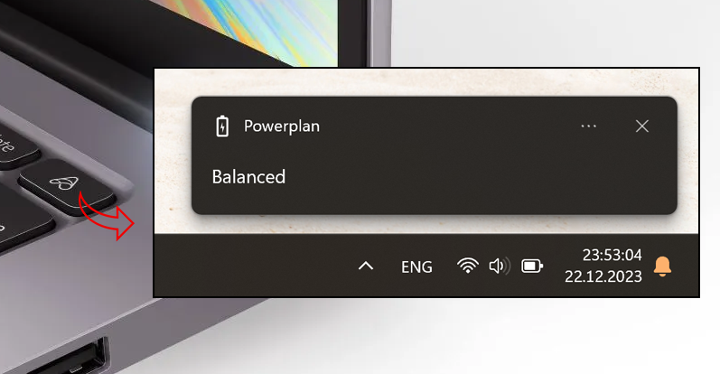

# PowerChanger - быстрая смена планов электропитания Windows

 PowerChanger — это утилита, которая позволяет выбирать следующий план электропитания среди всех планов простым запуском .exe файла.

    

 
 ## Попробовать
Releze WIN x64

## Стек технологий

 * C#, UWP
 * PowerManagerAPI, UWP.Notifications

## Лицензия
MIT license
